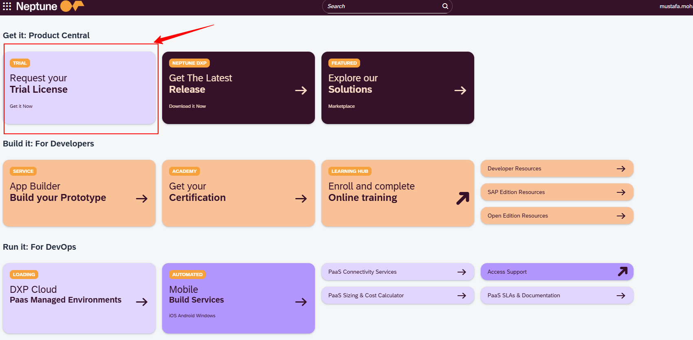
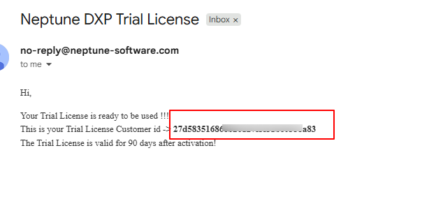

# Neptune DXP Free Trial License Setup

This guide walks you through obtaining and activating your Neptune DXP free trial license.

## Overview

Before you can use Neptune DXP locally, you need to obtain a trial license from Neptune Software. This process is free and takes just a few minutes.

## Setup Steps

### Step 1: Register or Sign In

1. Visit the **[Neptune DXP Free Trial page](https://www.neptune-software.com/free-trial/)**

2. Fill out the form data.
3. Then you will receive an email with the Neptune portal link.

4. Click on Register on the portal as well.
5. Once registration is completed, you will receive an email with your password.

### Step 2: Request Your Trial License
1. Once logged in to the Portal, and reset your initial password.
2. From the landing page, Click on the **Request Your Trial License** tile.

3. Follow the prompts to generate your license.
   
4. You will receive an email containing:
   - Your **Trial License ID** OR **Customer ID**
   - 

3. **Important**: Copy and save this information - you'll need it in the next step

